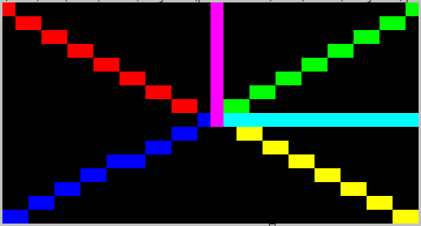
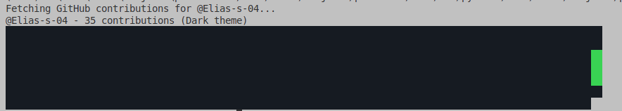

# pixelterm — Terminal Pixel Graphics Engine ██

**pixelterm** is a lightweight Python library that lets you draw and animate colorful pixel art directly in the terminal.  
It supports per-pixel color rendering using ANSI escape codes, shape drawing (lines, circles, rectangles), and smooth frame updates with no flicker.

> Think of it like `pygame`, but for your terminal window — powered by pixels made of Unicode blocks!

I later plan to use this for a Raspberry Pi to HUB75 matrix renderer building on the [https://github.com/hzeller/rpi-rgb-led-matrix](rpi-rbg-led-matrix) library by [https://github.com/hzeller](hzeller).

---

## Features

- **Full RGB color rendering** with ANSI escape codes  
- **Fixed-size virtual framebuffer** independent of terminal size  
- **Drawing primitives:** lines, rectangles, and circles (filled or outlined)  
- **Smooth animations** using an alternate terminal buffer  
- **Tiny & dependency-free** (no external libraries required)
- **Github contribution heatmap** rendered in terminal

---
## Pics




---

## Getting Started

### 1. Clone the repo
```bash
git clone https://github.com/Elias-S-04/pixelterm.git
cd pixelterm
